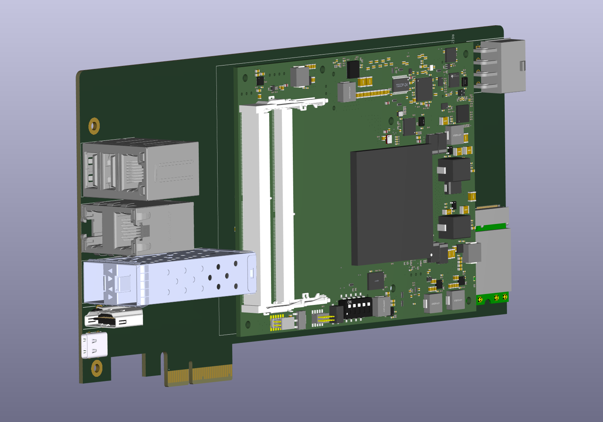

# COM Express 7 baseboard

This project contains a mechanical mock of a baseboard meant for COM Express 7 SoM.

Following interfaces are exposed:
## Key features

* PCIe card format
* Powered by 8-pin 12V connector.
* Compatible with COM Express 7
* 1x GBe
* 2x USB 3.0
* 2x 10G SFP+
* 2x 10G 10GBase-T
* 1x HDMI
* 1x Thunderbolt
* 2x M.2 key M
* 1x M.2 key E

