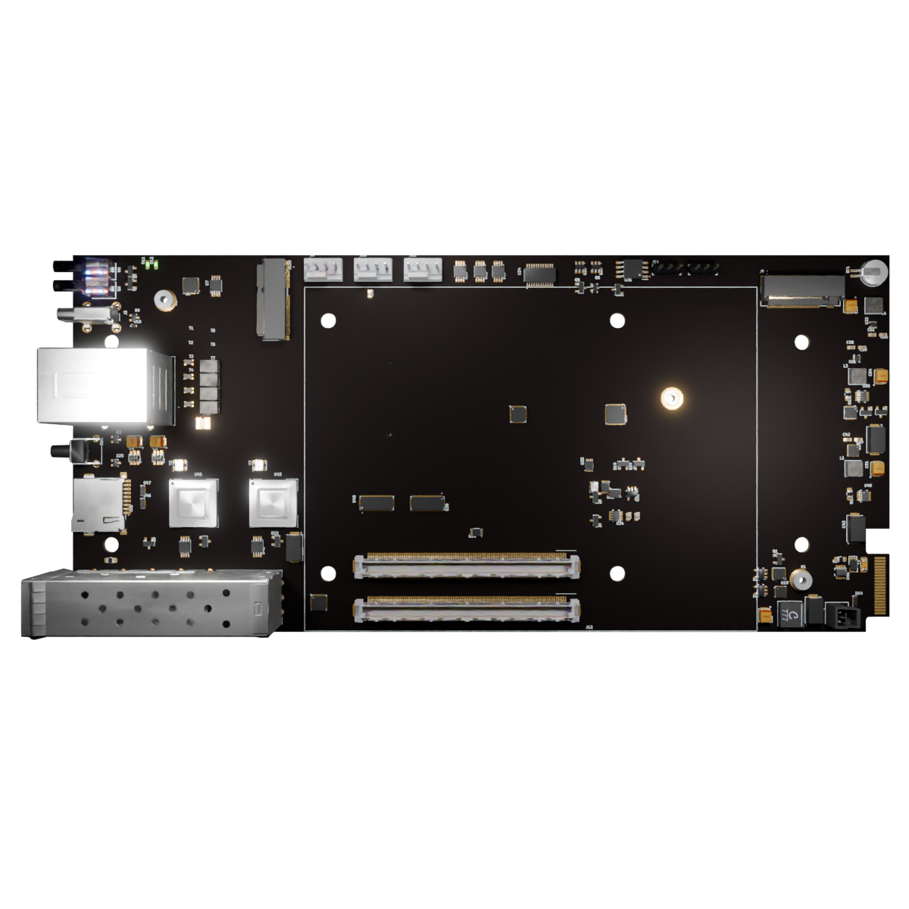

# COM Express 7 Baseboard

Copyright (c) 2022-2024 [Antmicro](https://www.antmicro.com)

## Overview

This project contains open hardware design files for a baseboard supporting COM Express 7 modules.
The board breaks-out major communications and peripheral interfaces provided by the standard.
It also provides a backplane connector which makes it possible to integrate this board into larger systems.

## Key features

* Two SFP+ 10G Ethernet ports
* OCuLink PCIe x4 connector
* Two USB 3.0 type A ports
* Gigabit RJ45 connector
* Singular +12V supply voltage
* USB-C console output
* Two M.2 key M with PCIe x4
* M.2 key E
* SD card connector
* Backplane connector with PCIe, USB and UART console
* Temperature and fan monitor/controller with 3 12V fan connectors
* LEDs for status indication
* Board power/current monitors
* Board EEPROM and support for carrier MAFS BIOS

## Project structure

The main directory contains KiCad PCB project files, a LICENSE, and a README.
The remaining files are stored in the following directories:

* `doc` - contains board schematic
* `assets` - contains visual assets for showcasing this design on [Open Hardware Portal](https://openhardware.antmicro.com/boards/com-express-7-baseboard/?tab=features&view=top-ortho).

## Licensing

This project is published under the [Apache-2.0](LICENSE) license.

