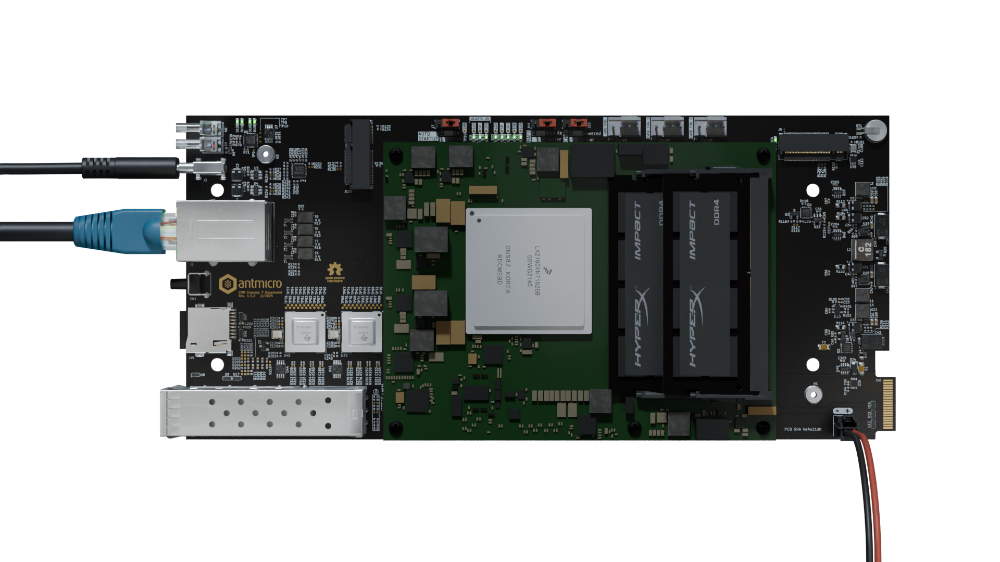
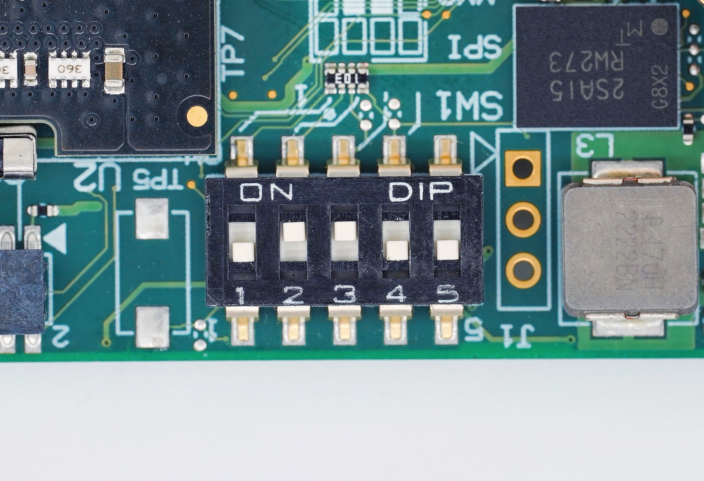

# Getting started guide

This manual will guide you through the initial setup of the open hardware `COM Express 7 Baseboard`. It describes the basic steps required to assemble the board with required peripheral accessories, write a compiled Board Support Package (BSP) to the processing module and get it booted. If you want to learn more about the `COM Express 7 Baseboard` itself, go to the [Introduction](./introduction.md) section. That section also includes an I/O map that may come in handy when locating interface connectors mentioned in this guide.
 
## Collect the hardware

To get started with the `COM Express 7 Baseboard`, you’ll need the following hardware:

### 1. COM Express 7 SoM
The `COM Express 7 Baseboard` is compatible with COM Express `Type 7` modules. The provided reference BSP has been developed for `SolidRun LX2160A` (SRX2160S01D00GE064V21C0)<!-- but it should work with other Type 7 modules as well -->.

### 2. RAM modules
You will need 2 `SO-DIMM DDR4 RAM` modules. Check the [list](https://solidrun.atlassian.net/wiki/spaces/developer/pages/197494332/LX2160A+COM+Tested+SO-DIMM+Memory) of tested modules, to help you choose appropriate RAM modules.

### 3. Power supply

The `COM Express 7 Baseboard` supports two power supply scenarios: 

* `DC locking connector` ([`J6`](#J6))
* `Backplane PCB-edge connector` ([`J16`](#J16))

More details in [Power supply](power_supply.md) chapter.

### 4. Fastening bolts

You will need five metric M2.5 (5mm long) bolts and a matching screwdriver to mount the SoM to the baseboard.
All mechanical fastening points located on the board support bolts with metric M2.5 thread (ISO 7045).

### 5. Micro SD card

Micro SD card with capacity of at least 4GB is needed, to transfer the BSP image to the baseboard.

### 6. Host PC

You will need a computer running Linux for flashing the reference BSP image to the SD card. 
The BSP flashing instructions provided below were verified with Debian based systems.
You may need to introduce minor adjustments for other Linux distributions.

### 7. SD card reader

You will need to be able to connect the micro SD card to your PC.
If your PC doesn't have an integrated SD card reader, you will need an external one.

### 8. Cabling

You will need a USB-C cable for connecting your PC to the USB-C port ([`J3`](#J3)) located on the baseboard.
This connection will provide access to the SoM's terminal on your PC.

Ethernet cable will be needed to provide internet connection to the `COM Express 7 Baseboard` via ([`J1A`](#J1)).

## Flash the SD card with system image

<!-- Instructions are from this [guide](https://solidrun.atlassian.net/wiki/spaces/developer/pages/197494288/HoneyComb+LX2+ClearFog+CX+LX2+Quick+Start+Guide). -->

### 1. Download a pre-built snapshot

Download this [pre-built snapshot image](https://solid-run-images.sos-de-fra-1.exo.io/LX2k/lx2160a_build/ls-5.15.71-2.2.0/2024-11-26_d5645d3/lx2160a_rev2_cex7_honeycomb_2000_700_2900_18_5_2-d5645d3.img.xz).

**NOTE:** This is a stock BSP, which doesn't support all functionalities of the `COM Express 7 Baseboard`.

### 2. Write the BSP image to the SD card

Plug the micro SD into your Linux PC. The following assumes that the micro SD is added as `/dev/sdX` and all it’s partitions are unmounted. In the terminal, run `sudo mount`, to check if the SD card is mounted. It can appear as /dev/mmcblk0p1 or /dev/sdb1 or similar. If partitions are mounted, unmount them first: `sudo umount <mount point>` (eg. `sudo umount /dev/sdc1`).
Now the image can be flashed to the SD card. 

Use this command for writing the image to an SD card (remember to use proper path to the BSP image and SD card):
`sudo xz -dc lx2160a_....img.xz | sudo dd of=/dev/sdX bs=4M conv=fsync`.

## Build your setup

To prepare the `COM Express 7 Baseboard` for initial usage, follow the steps described below: 

### 1. Install the RAM modules

Begin with installing the RAM modules on the COM Express 7 SoM.

### 2. Install the SoM

Securely attach the COM Express 7 SoM to the [`J12`](#J12) connector of the `COM Express 7 Baseboard`.
Fasten the SoM to the baseboard with five metric M2.5 (5mm long) bolts.
Remember to connect the cooling fan plug into the [`J11`](#J11) fan receptacle. 

### 3. Insert micro SD card

Insert the micro SD card containing the BSP, to the `COM Express 7 Baseboard` micro SD card slot ([`J15`](#J15)).

### 4. Select boot source

Configure the SW1 switch on the COM Express 7 SoM as shown on the image bellow.

:::{figure-md}


COM Express 7 boot source configured to SD card 
:::

<div align="center">

| Switch 1 | Switch 2 | Switch 3 | Switch 4 | Switch 5 |
|----------|----------|----------|----------|----------|
| OFF      | ON       | ON       | ON       | x        |

</div>

### 5. Connect the Ethernet port.

Connect the `COM Express 7 Baseboard` to the internet network using `RJ45` cable connected to [`J1A`](#J1) Ethernet port.

### 6. Connect the debug console

Connect the debug USB-C ([`J3`](#J3)) port to your PC. 
This should get a virtual USB/serial port registered in your system under ``/dev/ttyUSBx``.
You can check the ``lsusb`` or ``dmesg`` commands to verify if the serial bridge was enumerated properly.

:::{figure-md}


COM Express 7 Baseboard ready for flashing (SoM heat sink and fan not shown).
:::

## Flash the BSP image

The following steps will guide you through the process of flashing a precompiled Board Support Package (BSP) for the `COM Express 7 Baseboard`.

### 1. Open debug console

Whenever developing with the `COM Express 7 Baseboard`, it always makes sense to have a terminal hooked to the Debug UART on your host PC.
You can use any serial port terminal emulator for that, but we’ll use ``picocom`` in this guide.
Make sure that the [debug console USB](#connect-the-debug-console) is connected to your host PC and the USB-serial converter is enumerated:
```{code-block} bash
:emphasize-lines: 1,3

lsusb -d 0403:
# Bus 001 Device 118: ID 0403:6015 Future Technology Devices International, Ltd Bridge(I2C/SPI/UART/FIFO)
sudo dmesg | grep FTDI
# [1740634.745814] usb 1-4: FTDI USB Serial Device converter now attached to ttyUSB0
```

Run in the terminal:
```bash
sudo picocom -b 115200 /dev/ttyUSB0
```

<!-- You should keep the ``picocom`` terminal open in a separate window/tab throughout board flashing.
That will give you an insight into the progress and debug log messages displayed during the process. -->

### 2. Apply power

Pick one of the power supply scenarios described in the [Power Supply](#power-supply) section. 
We recommend using the DC locking connector ([`J6`](#J6)).
Apply power to the board.

Providing valid power supply should cause the ([`D18`](#D18)) power indicator LED to light up green.
*(That is if auto startup is enabled, otherwise you need to press the [`SW1`](#SW1) power button. More on that in the [Power supply](power_supply.md) chapter.)*

The SoM should start booting up, and you should see booting information on the `picocom` console.

### 3. Flash to eMMC

Stop the u-boot count down by clicking any key in the `picocom` console.

To flash to eMMC run the following commands (it will wipe your data on the eMMC device).
```bash
load mmc 0:1 0xa4000000 ubuntu-core.img
mmc dev 1
mmc write 0xa4000000 0 0xd2000
```

Boot the machine by running `boot`

### 4. Login

The SoM should boot up to the login screen visible in the debug console.
The reference BSP comes with a preconfigured root account.

Use the following login credentials to get access to the system:

```
localhost login: root
password: root
```

### 5. Finalize configuration

Using SW1 switch on the COM Express 7 SoM, configure it to boot from eMMC (change switch 4 to OFF), as shown on the image bellow.

:::{figure-md}


COM Express 7 boot source configured to eMMC
:::

<div align="center">

| Switch 1 | Switch 2 | Switch 3 | Switch 4 | Switch 5 |
|----------|----------|----------|----------|----------|
| OFF      | ON       | ON       | OFF      | x        |

</div>

Remove the micro SD card from the baseboard (this will make it easier to find the path for eMMC).


- Check location of the eMMC: `lsblk | grep mmcblk`. It should show up as `mmcblkX`, where `X` is an integer.

- Run `fdisk /dev/mmcblkX`.

- Recreate the first partition by deleting it and then creating a new partition that starts at block 131072 and extends to the end of the drive (or less depending on your needs).

- Write the new partition, when prompted `Do you want to remove the signature?`, answer with `No`.

- Run `resize2fs /dev/mmcblkXp1`.

Example execution of these commands is shown bellow (when no command was given, `Enter` was pressed).

```{code-block} bash
:emphasize-lines: 1, 6,16, 21, 29, 33, 36, 37, 38, 43, 45, 50
root@localhost:~# lsblk | grep mmcblk
mmcblk1      179:32   0 59.2G  0 disk
└─mmcblk1p1  179:33   0  350M  0 part /
mmcblk0boot0 179:64   0    4M  1 disk
mmcblk0boot1 179:96   0    4M  1 disk
root@localhost:~# fdisk /dev/mmcblk1

Welcome to fdisk (util-linux 2.37.2).
Changes will remain in memory only, until you decide to write them.
Be careful before using the write command.

This disk is currently in use - repartitioning is probably a bad idea.
It`s recommended to umount all file systems, and swapoff all swap
partitions on this disk.

Command (m for help): d

Selected partition 1
Partition 1 has been deleted.

Command (m for help): p
Disk /dev/mmcblk1: 59.22 GiB, 63585648640 bytes, 124190720 sectors
Units: sectors of 1 * 512 = 512 bytes
Sector size (logical/physical): 512 bytes / 512 bytes
I/O size (minimum/optimal): 512 bytes / 512 bytes
Disklabel type: dos
Disk identifier: 0x30303030

Command (m for help): n
Partition type
   p   primary (0 primary, 0 extended, 4 free)
   e   extended (container for logical partitions)
Select (default p):

Using default response p.
Partition number (1-4, default 1):
First sector (2048-124190719, default 2048): 131072
Last sector, +/-sectors or +/-size{K,M,G,T,P} (131072-124190719, default 124190719):

Created a new partition 1 of type 'Linux' and of size 59.2 GiB.
Partition #1 contains a ext4 signature.

Do you want to remove the signature? [Y]es/[N]o: N

Command (m for help): w

The partition table has been altered.
Syncing disks.

root@localhost:~# resize2fs /dev/mmcblk1p1
resize2fs 1.46.5 (30-Dec-2021)
Filesystem at /dev/mmcblk1p1 is mounted on /; on-line resizing required
old_desc_blocks = 3, new_desc_blocks = 474
The filesystem on /dev/mmcblk1p1 is now 62029824 (1k) blocks long.

```

- Run `dhclient` in order to enable internet access.

- Update the RTC clock by running `ntpdate pool.ntp.org` and then `hwclock -w`.

- Run `apt-get update && apt-get upgrade -y` and then populate the root filesystem as you wish.
